<picture>
  <source media="(prefers-color-scheme: dark)" srcset="./dark.svg">
  <source media="(prefers-color-scheme: light)" srcset="./light.svg">
  
</picture>

 

 

### About Me

I'm a B.Tech student in **Space Sciences & Engineering at IIT Indore**, working at the intersection of **computer vision, deep learning, and astrophysics**. I build models that find signal in noisy, high-dimensional data — whether that's tiny objects in high-altitude drone imagery or optical transients buried in years of telescope photometry.

- 🔭 Currently researching **AI-driven Gamma-Ray Burst classification** at IIT Indore (ML pipelines, UMAP, unsupervised anomaly detection on astrophysical time series)
- 🛰️ Building a **B.Tech Project** classifying optical transients (supernovae, AGN, stellar flares, TDEs) from ZTF / Rubin Observatory light curves
- 🚁 Long-running personal project: **YUKTIYANA**, a multi-modal UAV/UGV morphobot
- 🧠 Interned at **DRDO RCI, Hyderabad**, building a high-altitude tiny-object detection pipeline
- 🌱 Background in Engineering Physics: quantum mechanics, electrodynamics, statistical mechanics, and applied ML/DL

 

### 🧪 Experience

<table>
<tr>
<td width="140"><b>May–Jun 2026</b></td>
<td>

**ML Intern — DRDO RCI, Hyderabad**
Built a high-altitude tiny-object detection pipeline using **YOLOv12-L, YOLOv26-L, and RT-DETR-L**, with **SAHI tiled inference** and **ESRGAN/SwinIR super-resolution** preprocessing for low-resolution aerial imagery.

</td>
</tr>
<tr>
<td><b>May 2025–Present</b></td>
<td>

**Undergraduate Research Intern — IIT Indore**
AI-driven Gamma-Ray Burst reconnaissance and analysis using ML pipelines, UMAP dimensionality reduction, and unsupervised anomaly detection on astrophysical time series.

</td>
</tr>
<tr>
<td><b>Jun 2025–Present</b></td>
<td>

**Google DeepMind Hackathon**
Built an AI-powered mental health counsellor conversational agent.

</td>
</tr>
</table>

 

### 🚀 Featured Projects

<table>
<tr>
<td width="50%" valign="top">

**[DRDO Internship — Tiny Object Detection](https://github.com/Arnavdsp/DRDO-Internship-Overview)**
High-altitude tiny-object detection with YOLOv12-L / RT-DETR-L, SAHI tiled inference, and GAN-based super-resolution preprocessing on VisDrone-class imagery.

`Python` `PyTorch` `YOLO` `RT-DETR` `SAHI`

</td>
<td width="50%" valign="top">

**GRB Classification & Analysis**
Machine-learning pipeline for gamma-ray burst reconnaissance — UMAP + unsupervised anomaly detection over astrophysical time-series data.

`Python` `Scikit-learn` `UMAP`

</td>
</tr>
<tr>
<td width="50%" valign="top">

**Optical Transient Classification (B.Tech Project)**
Classifies supernovae, AGN, stellar flares, and TDEs from ZTF/Rubin photometric light curves using Gaussian Process interpolation, wavelet features, and Random Forest — **94.3% test accuracy** on the 3-class split.

`Python` `Astropy` `lightkurve` `Random Forest`

</td>
<td width="50%" valign="top">

**[Swarm-Tech-Algo](https://github.com/Arnavdsp/Swarm-Tech-Algo)**
Swarm-intelligence algorithms for coordinated multi-drone behavior — building blocks for the YUKTIYANA morphobot platform.

`Python` `Swarm Robotics`

</td>
</tr>
<tr>
<td width="50%" valign="top">

**[Line-Following Robot](https://github.com/Arnavdsp/Line-following-Robot)**
Autonomous IR-guided line-following robot — embedded control + sensor fusion fundamentals.

`C++` `Embedded Systems`

</td>
<td width="50%" valign="top">

**Water Bridge Detection via Satellite Imagery**
Geospatial deep-learning pipeline using semantic segmentation and object detection on multi-spectral satellite imagery.

`Python` `Semantic Segmentation` `Remote Sensing`

</td>
</tr>
</table>

 

### 🛠️ Tech Stack

 

### 📊 GitHub Analytics

 

### 📫 Connect

Built with a hand-crafted animated SVG banner — no third-party generator.

<!--
**Arnavdsp/Arnavdsp** is a ✨ _special_ ✨ repository because its `README.md` (this file) appears on your GitHub profile.

Here are some ideas to get you started:

- 🔭 I’m currently working on ...
- 🌱 I’m currently learning ...
- 👯 I’m looking to collaborate on ...
- 🤔 I’m looking for help with ...
- 💬 Ask me about ...
- 📫 How to reach me: ...
- 😄 Pronouns: ...
- ⚡ Fun fact: ...
-->
