<picture>
  <source media="(prefers-color-scheme: dark)" srcset="dark (1).svg">
  <source media="(prefers-color-scheme: light)" srcset="./light.svg">
  
</picture>

 

 

## AI Engineer | ML Engineer| Forward Deployed Engineer| Data Engineer & LLMops| Computer Vision and Space science Engineer

I am a **B.Tech student at IIT Indore** specializing in **Space Sciences & Engineering**, with a strong focus on **AI Engineering, Machine Learning, Deep Learning, and Computer Vision**.

I build and experiment with intelligent systems across **computer vision, autonomous systems, scientific machine learning, time-series intelligence, and applied AI**. My engineering approach combines mathematical foundations with hands-on model development, experimentation, evaluation, and real-world problem solving.

My background in engineering physics gives me a strong foundation for understanding complex systems, while my work across research, robotics, and applied ML allows me to translate that foundation into practical AI solutions.

### What I Work On

- **AI & Machine Learning** — supervised and unsupervised learning, representation learning, anomaly detection, model evaluation, and applied ML pipelines.
- **Deep Learning & Computer Vision** — object detection, image processing, semantic segmentation, super-resolution, and vision-based systems.
- **AI for Scientific Data** — machine learning for astrophysical time-series, high-dimensional data, and scientific discovery.
- **Intelligent & Autonomous Systems** — perception, swarm intelligence, robotics, and AI-driven decision systems.
- **Applied AI Engineering** — building end-to-end workflows from data preparation and experimentation to model evaluation and deployment-oriented pipelines.

Currently, I am applying these skills across **AI research, computer vision, autonomous systems, and scientific computing**.

 

## Experience

<table>
<tr>
<td width="170"><b>May - Jun 2026</b></td>
<td>

<b>Machine Learning Intern — DRDO RCI, Hyderabad</b>

Developed a **high-altitude tiny-object detection pipeline** for low-resolution aerial imagery. Evaluated and worked with **YOLOv12-L, YOLOv26-L, and RT-DETR-L**, while improving the inference pipeline through **SAHI tiled inference** and **ESRGAN/SwinIR super-resolution** preprocessing.

</td>
</tr>

<tr>
<td><b>May 2025 - Present</b></td>
<td>

<b>Undergraduate Research Intern — IIT Indore</b>

Developing AI/ML methods for **Gamma-Ray Burst reconnaissance and classification**. Designed analytical pipelines incorporating feature engineering, **UMAP dimensionality reduction**, and **unsupervised anomaly detection** for high-dimensional astrophysical time-series data.

</td>
</tr>

<tr>
<td><b>Jun 2025 - Present</b></td>
<td>

<b>Google DeepMind Hackathon</b>

Developed an **AI-powered conversational mental health counsellor**, exploring conversational AI, contextual interaction, and user-oriented intelligent systems.

</td>
</tr>
</table>

 

## Project Topography

<h2>Selected Projects</h2>

<table>
<tr>
<td width="50%" valign="top">

<h3><a href="https://github.com/Arnavdsp/DocuMind">DocuMind — Document Intelligence & Grounded RAG</a></h3>

Built an end-to-end <strong>RAG system for grounded document question answering</strong>,
with page-aware PDF extraction, OCR fallback, persistent embeddings, vector retrieval,
reranking, grounding thresholds, source citations, and explicit abstention when evidence
is insufficient.

<strong>Stack:</strong> Python · FastAPI · React · PyTorch · Sentence Transformers · PyTesseract · NumPy

</td>

<td width="50%" valign="top">

<h3><a href="https://github.com/Arnavdsp/Automatron">Automatron — Multi-Agent Decision Support</a></h3>

Engineered a <strong>multi-agent AI system</strong> with coordinator, researcher, analyst,
and executor roles across space, quantitative finance, e-commerce, and real-estate
workflows, using tool-grounded outputs, deterministic verification, human approval gates,
and auditable decision traces.

<strong>Stack:</strong> Python · LangGraph · LlamaIndex · Qdrant · Multi-LLM Routing · FastAPI · Docker · Cloud Run

</td>
</tr>

<tr>
<td width="50%" valign="top">

<h3><a href="https://github.com/Arnavdsp/DRDO-Internship-Overview">Tiny Object Detection for Aerial Imagery</a></h3>

Developed a <strong>task-driven tiny-object detection pipeline</strong> for high-altitude
aerial imagery, combining RT-DETR-L with ESRGAN/SwinIR super-resolution, SAHI
slicing, and NWD-based localization to address extremely small and low-resolution
targets.

<strong>Stack:</strong> Python · PyTorch · RT-DETR · ESRGAN · SwinIR · SAHI · NWD · Computer Vision

</td>

<td width="50%" valign="top">

<h3><a href="https://github.com/Arnavdsp/Aura-The-Mental-Wellness-Coach">Aura — Multimodal AI Wellness Coach</a></h3>

Built a <strong>multimodal Gemma 3n application</strong> supporting text, voice, and image
inputs with streaming responses, conversational memory, affect estimation, crisis
screening, and a preference-tuning pipeline using DPO/SFT with behavioural evaluation.

<strong>Stack:</strong> Python · Gemma 3n · PyTorch · Transformers · DPO · FastAPI · SSE · SpeechT5

</td>
</tr>

<tr>
<td width="50%" valign="top">

<h3><a href="https://github.com/Arnavdsp/Decentralized-Drone-Swarm">Decentralized Drone Swarm</a></h3>

Designed a <strong>decentralized multi-drone autonomy stack</strong> combining distributed
formation control, cooperative payload lifting, UDP mesh communication, RT-DETR aerial
detection, NWD-based tracking, and fault-aware mission state management.

<strong>Stack:</strong> Python · RT-DETR · NWD · MAVLink · Raspberry Pi · Distributed Control · Computer Vision

</td>

<td width="50%" valign="top">

<h3><a href="https://github.com/Arnavdsp/Research-Internship-IITI-DAASE-Overview">GRB Analysis & Unsupervised ML</a></h3>

Developed an astrophysical ML pipeline for <strong>Gamma-Ray Burst light curves</strong>,
covering wavelet denoising, Fourier and temporal features, PCA/UMAP dimensionality
reduction, HDBSCAN clustering, and controlled simulations to distinguish astrophysical
structure from preprocessing and noise artefacts.

<strong>Stack:</strong> Python · NumPy · SciPy · Scikit-learn · UMAP · HDBSCAN · PyWavelets · Time-Series ML

</td>
</tr>
</table>

## Technical Stack

 

### AI / ML

`Machine Learning` `Deep Learning` `Computer Vision` `Object Detection` `Anomaly Detection` `Time-Series Analysis` `Dimensionality Reduction` `Model Evaluation`

### Engineering

`Python` `PyTorch` `OpenCV` `Scikit-learn` `NumPy` `Pandas` `C++` `Linux` `Git`

### Applied Domains

`Autonomous Systems` `Robotics` `Remote Sensing` `Scientific ML` `Astrophysics`

 

## Current Focus

I am currently focused on becoming a stronger **end-to-end AI Engineer** — moving beyond individual models toward the design of reliable AI systems.

My current areas of development include:

- Building robust **ML/DL pipelines**
- Developing stronger **computer vision systems**
- Learning modern **Generative AI and LLM architectures**
- Improving model evaluation, experimentation, and optimization
- Understanding **AI system design and deployment**
- Combining perception, learning, and decision-making in autonomous systems

 

## GitHub Analytics

 

 

## Let's Connect

 

Engineering intelligent systems across AI, perception, autonomy, and scientific computing.

<!--
Arnavdsp/Arnavdsp is a special repository because its README.md
appears on the GitHub profile page.
-->
