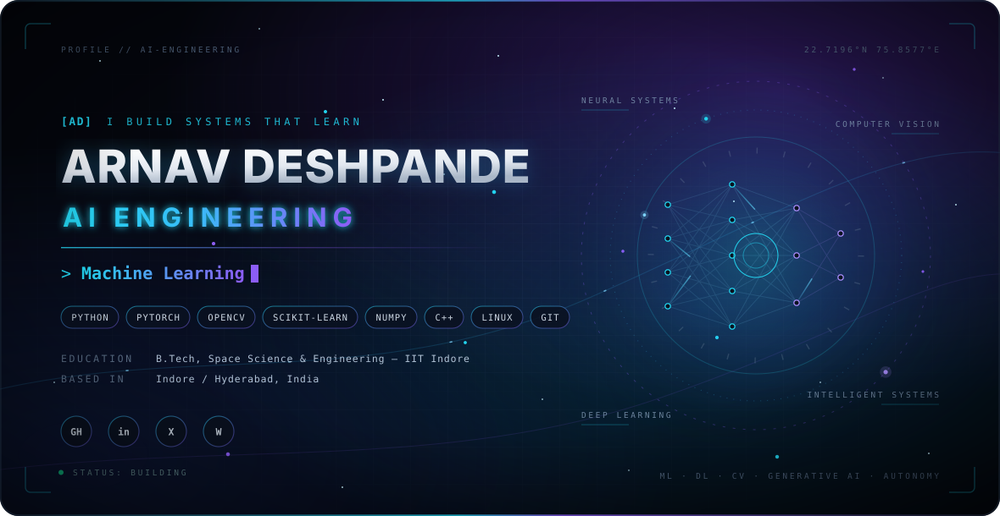

<picture>
  <source media="(prefers-color-scheme: dark)" srcset="dark%20(1).svg">
  <source media="(prefers-color-scheme: light)" srcset="light.svg">
  
</picture>

# Arnav Deshpande

B.Tech, Space Science & Engineering, IIT Indore. I build LLM systems (retrieval, agents, tool servers) and try to measure where they fail.

[LinkedIn](https://www.linkedin.com/in/arnav-deshpande-26a792290/) · [Email](mailto:arnavhpd@gmail.com) · [Portfolio](https://arnav-portfolio-arp8-dc7rqha06-arnav-deshpande.vercel.app/)

## Start here

| Project | What it is |
|---|---|
| [edgar-mcp](https://github.com/Arnavdsp/edgar-mcp) | MCP server with six tools over SEC EDGAR filing data, plus an eval harness against a gold question set |
| [DocuMind](https://github.com/Arnavdsp/DocuMind) | Document Q&A over PDFs: hybrid retrieval, reranking, citations, and abstaining when the evidence isn't there |
| [DRDO-Internship-Overview](https://github.com/Arnavdsp/DRDO-Internship-Overview) | Internship work: tiny-object detection on VisDrone2019-DET with RT-DETR |
| [Automatron](https://github.com/Arnavdsp/Automatron) | Multi-agent decision-support workflows with validation steps and human approval gates |
| [Aura](https://github.com/Arnavdsp/Aura-The-Mental-Wellness-Coach) | Google Gemma 3n hackathon entry: a multimodal wellness coach with crisis screening, plus LoRA/DPO training code |
| [ai-systems-lab](https://github.com/Arnavdsp/ai-systems-lab) | Small experiments with tests: DAG planning, rank fusion, retrieval metrics, memory estimates |

## Also

| Project | What it is |
|---|---|
| [lost-in-the-middle-2026](https://github.com/Arnavdsp/lost-in-the-middle-2026) | Replicating *Lost in the Middle* (Liu et al., TACL 2024) with the authors' data and prompts, on current models |
| [Evaluation-assurance](https://github.com/Arnavdsp/Evaluation-assurance-for-Deccan-AI) | Which of an LLM judge's PASS verdicts a human should re-check, ranked with execution checks (synthetic data) |
| [Gargantua](https://github.com/Arnavdsp/Gargantua-end-to-end-RAG-pipeline) | A RAG pipeline whose retrieval state drives a black-hole raytracer: chunks are the accretion disk, citations light up |
| [Optical transient classification](https://github.com/Arnavdsp/Optical-Transient-Hierarchial-Classification) | Two-stage classifier for optical transients from light-curve features (TNS labels, ZTF and TESS photometry) |
| [GRB analysis](https://github.com/Arnavdsp/Research-Internship-IITI-DAASE-Overview) | Research internship at IIT Indore: clustering gamma-ray burst light curves with UMAP and HDBSCAN |
| [Bridge detection](https://github.com/Arnavdsp/Water-Bridge-Detection-Through-Satellite-Imagery) | YOLOv8-OBB for bridges over water in aerial imagery, on free Kaggle/Colab GPUs |
| [Quick-commerce case study](https://github.com/Arnavdsp/Quick-Comerce-Case-Study) | Unit economics of Blinkit vs Swiggy Instamart vs Zepto from shareholder letters and the IPO filing |

## Working with

Python, PyTorch, FastAPI, sentence-transformers, LangGraph, Docker, Hugging Face Spaces.
